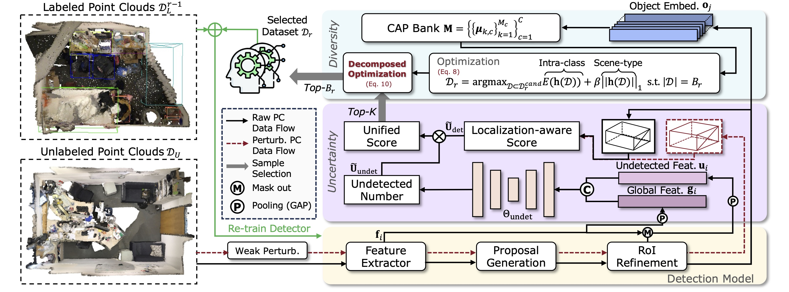

# Uncertainty Meets Diversity

This repo is the official implementation of the paper:
#### Uncertainty Meets Diversity: A Comprehensive Active Learning Framework for Indoor 3D Object Detection
[PaperLink](https://arxiv.org/pdf/2503.16125)



## NEWS
- Offical implementation based on [OpenPCDet](https://github.com/open-mmlab/OpenPCDet) codebase and [CAGroup3D](https://github.com/Haiyang-W/CAGroup3D) detector is released.
- UMD is accpeted at CVPR 2025.

## Introduction
This paper presents the first solution to apply active learning in indoor 3D object detection, utilizing both uncertainty and diversity as selection criteria. For uncertainty, we design a two-pronged epistemic uncertainty estimation strategy to address inaccurate detections and undetected objects, which first assesses uncertainty separately for each case, then integrates them into a unified criterion. For diversity, we frame the diverse sample selection problem as an optimization task that jointly maximizes scene-type diversity and intra-class variances, leveraging a novel Class-aware Adaptive Prototype (CAP) bank. 

## Train & Test
- Training:
```bash
CUDA_VISIBLE_DEVICES={} ./scripts/dist_train.sh {num_gpus} --cfg_file cfgs/scannet_models/CAGroup3D_active.yaml --extra_tag {your name} --fix_random_seed
```

- Testing:
```bash
CUDA_VISIBLE_DEVICES={} ./scripts/dist_test.sh {num_gpus} --cfg_file cfgs/scannet_models/CAGroup3D_active.yaml --ckpt {your pth}
```

## Main Results
We reproduce UMD based on [OpenPCDet](https://github.com/open-mmlab/OpenPCDet) codebase and [CAGroup3D](https://github.com/Haiyang-W/CAGroup3D) detector. All models are trained with 2 3090 GPUs.
|   Dataset | mAP@0.25 (10\% Data) | mAP0.50 (10\% Data) | mAP@0.25 (Full Data) | mAP@0.25 (Full Data) |
|----------|:----------:|:-------:|:-------:|:-------:|
| [ScanNet](tools/cfgs/scannet_models/CAGroup3D.yaml) | 61.7  |	45.9 | 72.6 | 58.8 |
| [Sun RGB-D](tools/cfgs/sunrgbd_models/CAGroup3D.yaml) | 56.1   |	35.4 | 64.5 | 47.4 |

## Citation
Please consider citing our work as follows if it is helpful.
```
@inproceedings{wang2025uncertainty,
  title={Uncertainty Meets Diversity: A Comprehensive Active Learning Framework for Indoor 3D Object Detection},
  author={Wang, Jiangyi and Zhao, Na},
  booktitle={Proceedings of the Computer Vision and Pattern Recognition Conference},
  pages={20329--20339},
  year={2025}
}
```

## Acknowledgments
This project is based on the following codebases.
* [OpenPCDet](https://github.com/open-mmlab/OpenPCDet)
* [CAGroup3D](https://github.com/Haiyang-W/CAGroup3D)
* [CRB-active-3Ddet](https://github.com/Luoyadan/CRB-active-3Ddet)
